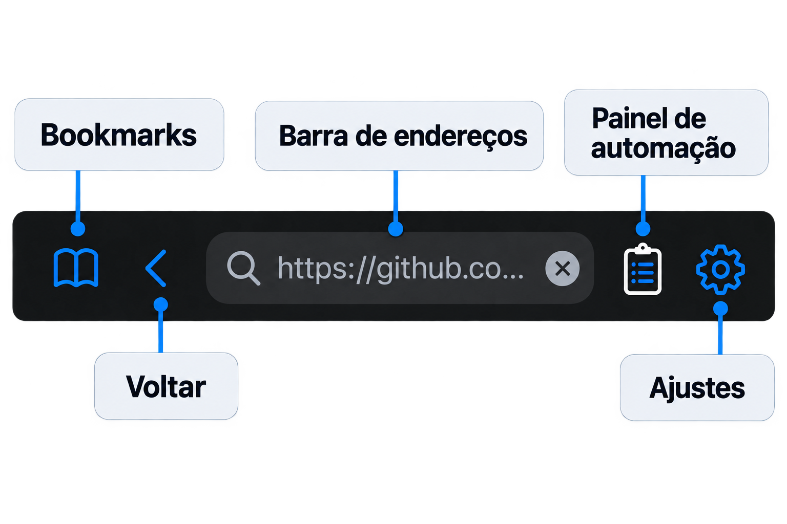
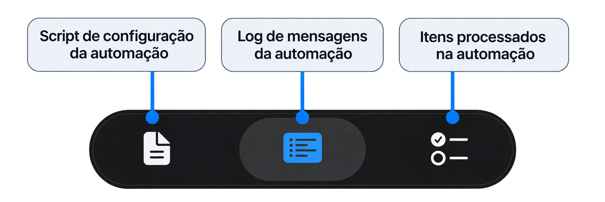

## Aplicativo Navi




---
---

## Configuração da Automação

**`urlMonitor`**  
URL da página ou serviço que o NAVI deve consultar periodicamente para identificar novas informações ou eventos.

Exemplo: `https://exemplo.com/api/novos-itens`

---

**`triggerMonitor`**  
Padrão Regex utilizado para identificar informações no conteúdo monitorado.

Exemplo: `[A-Z]{3}[0-9]{4}`  
Identifica valores como `ABC1234`.

---

**`urlAction`**  
URL da página que o NAVI vai acessar quando o evento monitorado for identificado.

Exemplo: `https://exemplo.com/produto/`

---

**`mainVerify`**  
Define a verificação realizada na página antes da ação.

**`type`**  
Tipo de verificação.

Válidos: `exists`, `confirm`, `click`

<br>

**`selector`**  
Seletor CSS utilizado para localizar um elemento na página.

Exemplo: `div[class='produto-titulo']`  
Válido para: `exists`, `click`

<br>

**`message`**  
Mensagem exibida no alerta de confirmação.

Válido para: `confirm`

---

**`mainAction`**  
Define a ação realizada pelo NAVI quando a condição for atendida.

**`type`**  
Tipo de ação.

Válidos: `exists`, `confirm`, `click`

<br>

**`selector`**  
Seletor CSS utilizado para localizar um elemento na página.

Exemplo: `button#comprar`  
Válido para: `exists`, `click`

<br>

**`message`**  
Mensagem exibida no alerta de confirmação.

Válido para: `confirm`

---
---


## Exemplo Prático

Aqui temos um exemplo de como podemos utilizar o NAVI.

Esta configuração recupera, por meio da API aberta da OpenSky, os aviões que estão sobrevoando Minas Gerais neste momento, identifica os respectivos números dos voos e abre, para cada um deles, a página correspondente no FlightAware com seus detalhes. 
```
{
  "urlMonitor": "https://opensky-network.org/api/states/all?lamin=-22.95&lomin=-51.30&lamax=-14.10&lomax=-39.80",

  "triggerMonitor": "[A-Z]{3}[0-9]{4}",

  "urlAction": "https://www.flightaware.com/live/flight/",

  "mainVerify": {
    "type": "exists",
    "selector": "div[class='flightPageFriendlyIdentLbl']"
  },

  "mainAction": {
    "type": "confirm",
    "message": "Ir para o proximo?"
  }
}
```

---
---


## Perguntas Frequentes

Estou recebendo o erro "Monitor Failed: 400 Bad Request"
- Realizar a limpeza do cache (Engrenagem > Settings > Cache > Clear) e reiniciar o processo de automação.


