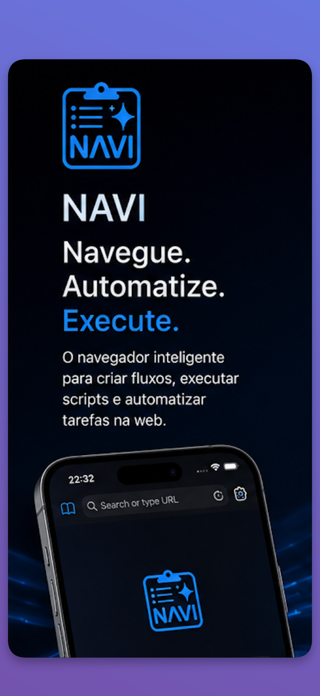
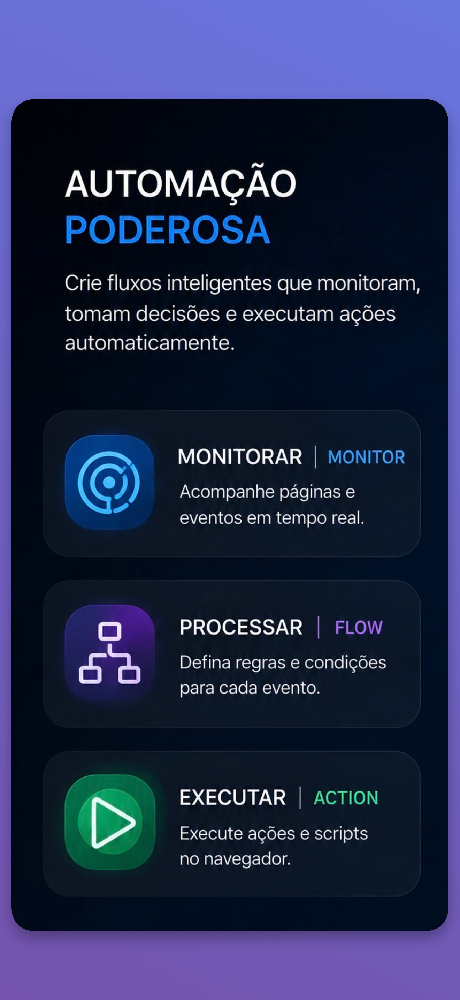
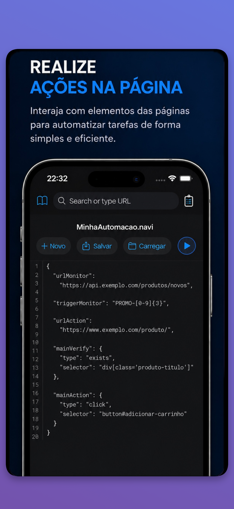

# NAVI — Navegação Inteligente

NAVI é um navegador desenvolvido para tornar a interação com a web mais prática e automatizada.

Além da navegação tradicional, o NAVI permite criar e executar rotinas de automação capazes de interagir com páginas da web, acompanhar informações e realizar tarefas repetitivas de forma estruturada.

[Ajuda e Exemplos](AJUDA.md)

## AUTOMAÇÃO WEB

Crie fluxos personalizados para executar uma sequência de ações no navegador, como acessar páginas, aguardar carregamentos, interagir com elementos e realizar ações sobre o conteúdo da página.

## SCRIPTS DE AUTOMAÇÃO

Utilize as funcionalidades do motor baseado em JavaScript no contexto das páginas visitadas para realizar ações e verificações durante uma automação, tornando os fluxos mais flexíveis e adaptáveis.

## FLUXOS E TAREFAS

Organize ações em sequências reutilizáveis para transformar tarefas repetitivas em rotinas automatizadas.

O Navi é estruturado em três pilares que trabalham de forma integrada: **Monitor**, responsável por identificar eventos e mudanças; **Flow**, que processa e transforma essas informações; e **Action**, que executa automaticamente as ações definidas.

## NAVEGADOR COM AUTOMAÇÃO

O NAVI combina a experiência de um navegador com recursos de automação web e execução de rotinas, permitindo automatizar interações realizadas durante a navegação.

Ideal para tarefas repetitivas, verificações, acompanhamento de informações, testes e outros processos que envolvem interação com páginas da web.

O uso do NAVI deve respeitar as leis aplicáveis e os termos de uso dos sites e serviços acessados.

- [Política de Privacidade](PRIVACY_POLICY.md)
- [Shopee Affiliate](https://seller.shopee.com.br/creator-center/insight/live/list)
